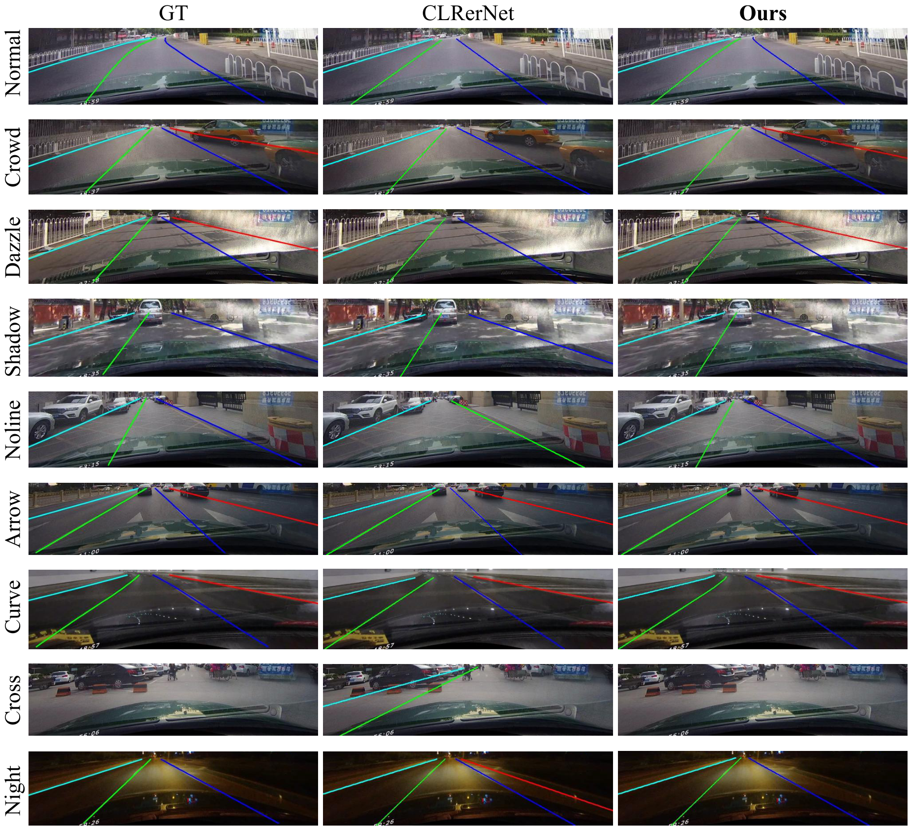
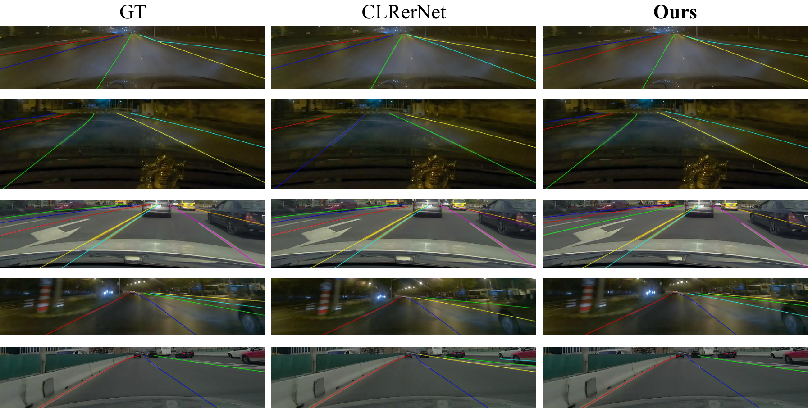
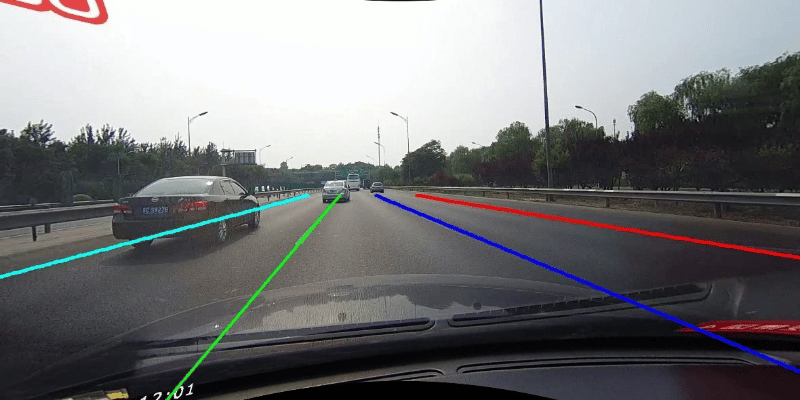
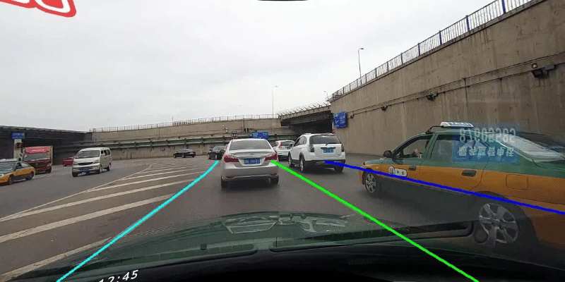
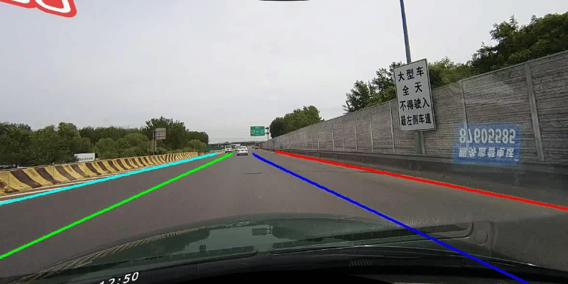
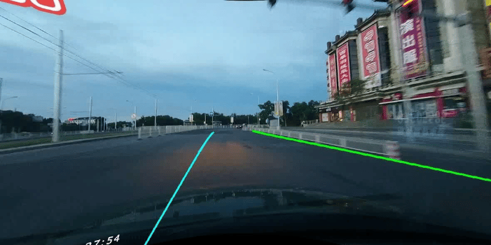

# GFSR: Geometric Fidelity and Spatial Refinement for Reliable Lane Detection

Paper: [arXiv:2605.23327](https://arxiv.org/abs/2605.23327)

The full runnable GFSR code will be released publicly once the paper is accepted for publication.

## Qualitative Comparison

Columns are ground truth, CLRerNet, and GFSR (Ours).

### CULane

### CurveLanes

## Demo

